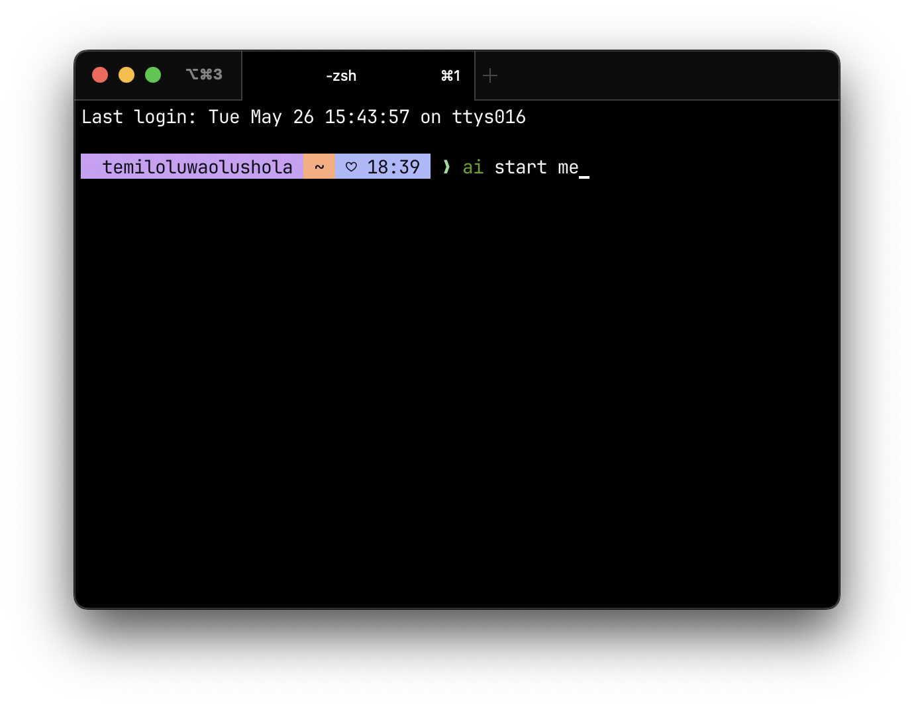

# Terminal aesthetic (macOS)

Ghostty + zsh + zinit + Starship (Catppuccin Mocha) + modern CLI tools. One script.



## What ships

- **Ghostty** terminal — pre-configured font + Catppuccin Mocha theme
- **JetBrainsMono Nerd Font Mono** (for prompt glyphs)
- **Starship** prompt — Catppuccin Mocha, segmented powerline style
- **zsh + zinit** with async plugins:
  - `fast-syntax-highlighting`
  - `zsh-autosuggestions`
  - `zsh-completions`
- **zoxide** — `z <partial>` jumps to frequent dir
- **fzf** — `Ctrl-R` history search, `Ctrl-T` file picker
- Aliases: `ls`/`ll`/`la`/`lt` → eza · `cat` → bat · `find` → fd

## Install

```bash
git clone <this-repo> ~/terminal-aesthetic
cd ~/terminal-aesthetic
chmod +x install.sh
./install.sh
```

Then:

1. `exec zsh`
2. Restart Ghostty — it picks up the font and theme from the symlinked config.

No manual font picking: `install.sh` symlinks `dotfiles/ghostty-config` to
`~/.config/ghostty/config`, which sets `JetBrainsMono Nerd Font Mono` (the name
Ghostty actually reports for the cask — verify with `ghostty +list-fonts`).

## Files

| Path | Purpose |
|---|---|
| `Brewfile` | brew packages + casks |
| `install.sh` | idempotent installer (brew + symlinks) |
| `dotfiles/zshrc` | shell config + aliases + zinit bootstrap |
| `dotfiles/starship.toml` | prompt theme |
| `dotfiles/ghostty-config` | terminal font, theme, padding |

## Uninstall

Backups at `~/.zshrc.bak`, `~/.config/starship.toml.bak`,
`~/.config/ghostty/config.bak`. Restore manually.
